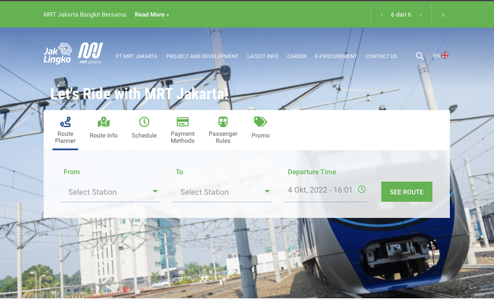

# ASSIGNMENT #01: Heuristic Evaluation

## Accessible and Sustainable Transportation in Jakarta, Indonesia

*by Brian Roysar | DH 110: User Experience Design*

### About The Project

This project will focus on the 11th Sustainable Development Goal (SDG), Sustainable Cities and Communities, established by the United Nations (UN) as a way to achieve a "shared blueprint for peace and prosperity for people and the planet" by 2030. The project will be focusing on a small subset of this overarching goal which is the creation of more accessible and sustainable transportation in Jakarta, Indonesia.

Having lived in Jakarta my entire life, I've experienced first-hand how inefficient transportation and commuting can be. A lack of structured roads and public transportation only being in its early stages of development, the lack of accessible and efficient transportation has frustrated many Indonesians as commute times and congestion are exponentially high. In addition, with Indonesia being in the top 20 most polluted countries in the world, there should be a larger emphasis on improving the sustainability of many of our transportation methods to maintain a good quality of life in the long term.  

Thus, I want to use this UX project to create a website or mobile app that will encourage fellow Indonesians to learn more about and use existing public transportation systems in order to reduce both congestion and pollution from private vehicles such as cars and motorcycles.

### About This Assignment

In this assignment, I will be conducting a heursitic evaluation through examining the _10 Usability Heuristics of User Interface Designs_ and _Severity Ratings for Usability Problems_ of two websites that are similar to the project idea I chose. 

### Website #1: MRT Jakarta

[Website Link](https://jakartamrt.co.id/en)

#### Information About The Website
jakartamrt.co.id is the official website for the Jakarta MRT system that was recently opened in the past decade. The website serves the purpose of highlighting the mission/vision of the project, the recent developments of the project, and most importantly, provides travelers with information about routes given a source, destination and time. 

#### Overall Evaluation of The Website
Although the website is clean and relatively simple to use, it does not efficiently captivate citizens to use the website. This is because the design is very bland and feels outdated to an extent. The presentation of data (whether this is route information, times that the MRT leaves and arrives, and payment methods) is not appealing, which not only makes information difficult to digest, but also less memorable to the user. 

