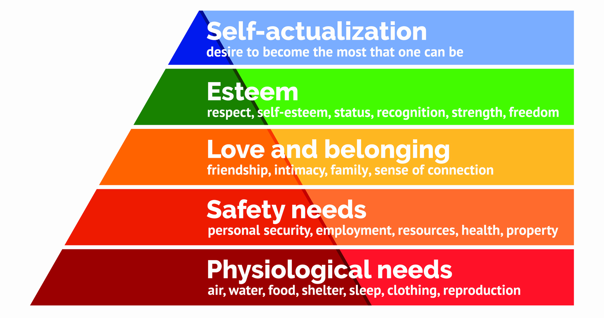

# ASSIGNMENT #03: Learning from people in context
_by Brian Roysar | DH 110: User Experience Design_

## Step 1: Research goal + requirements

### **What is the main activity your project would support for the users?**

Encourage the use of the public transportation system in Jakarta, Indonesia by providing users with more accessible and easy-to-digest information about available routes and the system as a whole. 

### **What is the basic need/goal involved for that activity? (reference)**
Referring to Maslow’s hierarchy of needs, this activity will serve three different goals which are:

1. **Physiological needs**: accessible transportation for people to obtain resources such as food (grocery shopping, restaurants), water, and travel to places of shelter (homes, apartments, hotels)
2. **Safety needs**: accessible transportation enables people to commute to their workplaces which allows them to obtain economical security
3. **Love/social belonging needs**: accessible transportation enables people to commute to social gatherings with friends and family, allowing them to feel more connected and a stronger sense of social belonging

### **What is(are) the traditional/current solution(s) to satisfy the needs?**
The existing solutions for accessible transportation range from using the official websites of independent transportation systems (MRT or bus) and utilizing generic navigational apps such as Google Maps to discover different ways to get from place to place. 

### **What is(are) the limitation(s) that possibly would be improved?**
The current limitations are that the official websites of each public transportation system are independent from each other, hence forcing users to cross-reference multiple websites to obtain information about their desired route. In addition, despite the fact that applications such as Google Maps integrate multiple systems in one place, it is not well integrated with real-time updates on possible delays/alterations to routes.

## Step 2: Target users

### **What are the characteristics of users? (ex. demographics, preference, expertise, mainstream vs. extreme)**

User demographic: any person of age to travel alone on public transportation, citizens and tourists, potentially more focused on people that depend on public transportation for commuting to and from work
User preference: people seeking cheaper and/or more sustainable ways to commute and travel
User expertise: mainstream; no required level of expertise

### **In which context (where, why, under which conditions) would the users do that activity?**
Users would do this at home before going about their commute, or when they reach the station and attempting to decide where to get off/transit/change systems. Users would need to look and find routes when they are planning their way to work, social gathering, exploring the city and anything else that requires them to commute.

### **What would the users usually do in order to complete that activity?** 
Users can discover information about their routes through the websites and applications previously mentioned. More traditional commuters could also refer to physical, static maps that are posted on the stations, and manually find their routes that way. 

## Step 3: Research methods and plan
There are a plethora of research methods that range from being close to participants to being distanced and detached. To obtain the most holistic responses, I have chosen to conduct a mixture of interview and participatory observation. This means that the research will involve questions that I ask about the user’s background, experiences and struggles with the problem, and also observe how they currently solve the problems. The interview and activity will be conducted virtually as I am not in Jakarta, and this acts as a geographical/physical barrier to doing it in-person. It will take place 6-10pm to allow participants to do this after their work hours. Finally, for data collection, we will record audio and video from the interview as well as have a digital note taker during the interview to keep track of the notable pieces of information.

## Step 4: Interview/observation guide
Here is a [link](https://docs.google.com/document/d/1ws12eqgx5XDZ3clfp4RJtvsXS-oeV_v39y5L26bLp_I/edit?usp=sharing) to the interview/observation guide. 

## Step 5: Representative data files
Here is a [link](https://drive.google.com/file/d/10h-nS0IAd55L-QphAqdsUU9q8kBk52Yo/view?usp=sharing) to the recording (video + audio + screen share) of the whole interview.

## Interview transcript
Here is a [link](https://docs.google.com/document/d/1mpoF0uNg6VjHPvriPHhkupKCanX_Y1D7GH_tOspPIco/edit?usp=sharing) to the interview transcript.

## Key quotes and insights
> “Traffic's pretty bad in Jakarta, so I use public transportation to avoid it. That's also much cheaper. You don't have to worry about parking as well.”

I learnt from this that people that have personal cars and modes of transportation still choose to use public transportation due to their cheap cost, convenience and time-efficiency. This allows us to market and create our application for a broader range of people, as we are not only limiting our target audience to individuals who do not have personal vehicles. 

> “I think it'd be great if these kinds of platforms or apps can show what is famous near that area to visit, especially as a tourist. But maybe besides that a sort of like a quick phone call to the police in case you know, there's any dangerous events in that area or something along those lines.”

Although the user prioritizes the necessary information about a route, there are other factors such as nearby tourist spots that a user would want to know when looking at a route, especially from a tourist’s point of view. In addition, something I never thought about is that the user would want a safety feature integrated, where it would alert the user if there are any nearby danger or threats, and a mechanism to call the police if necessary. This targets the users safety needs as one must feel safe in order to feel like their needs have been met. 

> “I think, having like a one stop shop app, that sort of encapsulates all public transportation into that one app like starting from you know how to find a stop itself all the way to getting to your destination. I think that would just be super useful, because right now in Jakarta every single public transport sort of has their own thing going on.”

Here, we learn about the lack of cohesion between the different public transportation systems in Jakarta, and how it makes it very hard for the user to utilize multiple systems in their commute as each system is not enough to cover the whole city. This confirms our hypothesis in which a system that integrates information from multiple systems can be very beneficial to the user experience when they are trying to find their way around the city.

## Reflection
From the study I did, I learnt a lot of new things, while also confirming the assumptions I had coming in about the problem at hand. I learnt that this user really prioritizes the important and necessary information (such as arrival time, cost, duration) of the trip rather than other information such as tourist spots, restaurants along the way when asked what he wanted to see when presented a route. As well as the input fields, the user rather has a simple system that gives the necessary information quickly and efficiently. We also learnt that the user struggles with consolidating information of routes from different public transportation systems, as he has to cross reference multiple websites/apps/maps to formulate his overall commute method. 

In terms of the study itself, the interview went really well despite the virtual setting. The setting enabled screen sharing which made it easy to see and record the user’s screen while he was performing the tasks. The subject was able to respond to the questions well and clear, while elaborating on some of his answers. Moving forward, I would want to push more for elaboration and reasoning on some points as answers felt very short for some questions, and it made it very hard to extract any information from it. If I had the chance, I would also want to conduct a similar study in-person with someone that frequently uses public transportation, and observe how they use route-finding systems on their daily commute. From this process, I also learnt that having a transcript record of the conversation is really helpful to notice things that were unnoticed by the interviewer/note taker during the interview, since it is challenging to try to process all the information in real time while asking questions and conducting the interview. 
