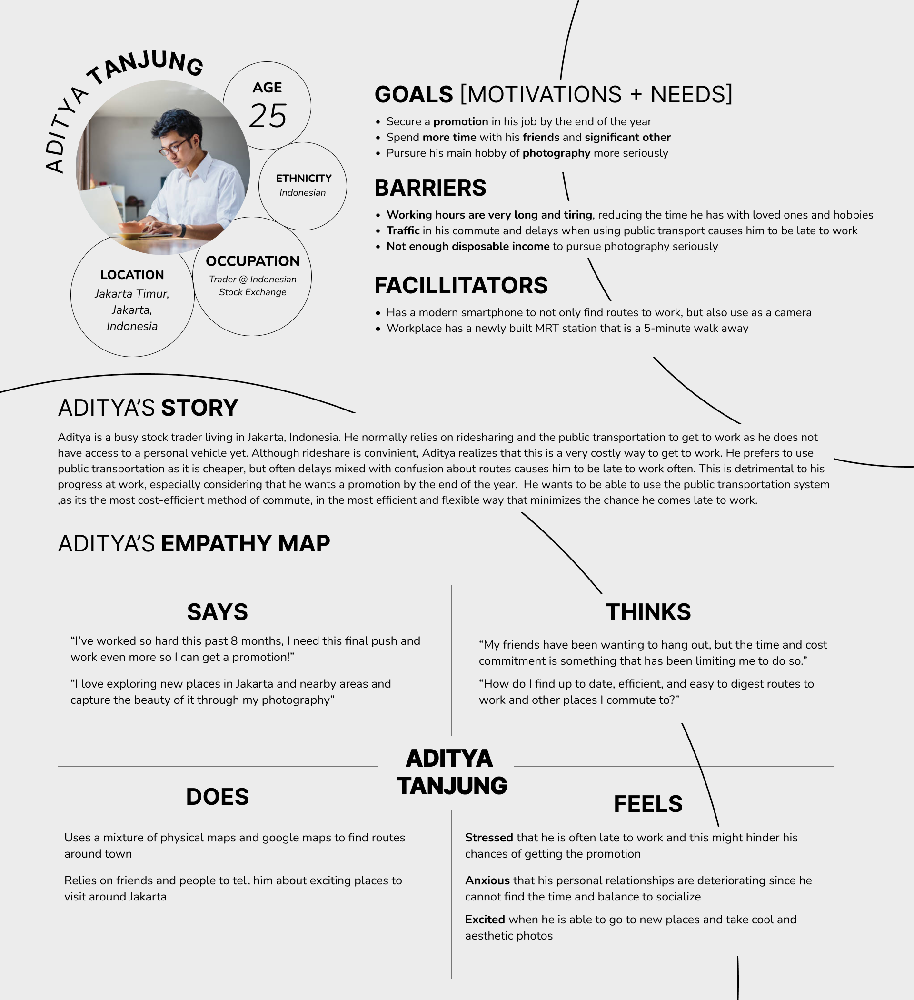
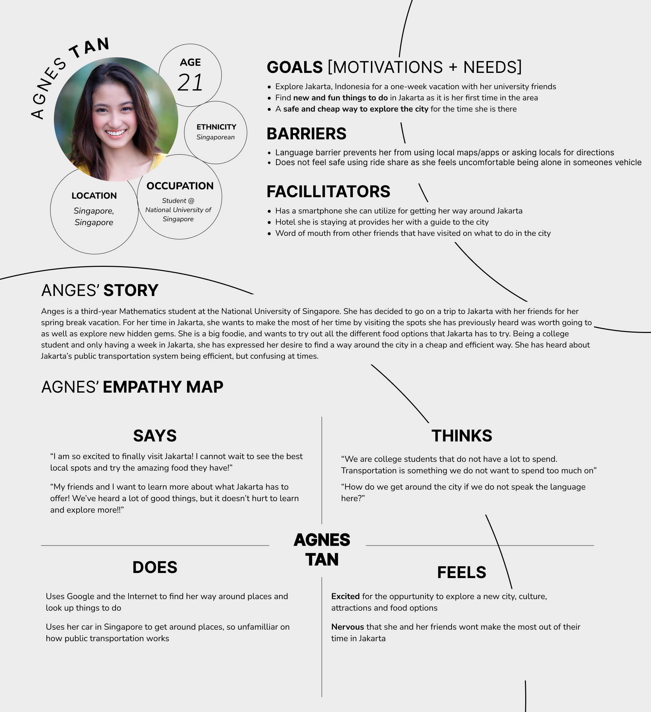

# ASSIGNMENT #04: Persona + Scenario
_by Brian Roysar | DH 110: User Experience Design_

## Purpose of UX storytelling
UX storytelling is essential for us to detach our own thoughts, wants, emotions from the problem we are trying to tackle; it forces us to reshift our perspective to a plethora of different users perspectives, and from that exercise, we are able to have a more holistic understanding of the problem and how we will solve it. It ultimately allows us to be in the shoes of potential users in the real world and make the product focus more on the user's needs and goals. In my project, as someone who does not use public transportation as much, it would be very useful to explore perspectives of people that potentially use the system more, as they are the ones who will interact and use the product more often. In addition, since public transportation is utilized by many people that come from many different backgrounds (not just one niche demographic), UX storytelling will allow us to understand the large and wide market that our product is dealing with.

## Tasks
1. **Integrated Route-Finding:** Allows users to find routes that utilize multiple transit systems (Bus, MRT, Train) all in one application. User will also have multiple inputs that they can use to tailor their search (source/destination, time, system preferences, areas to avoid (safety), intermediate stops along the way)
2. **Recommended Activities:** Presents users with fun things to do, restaurants/cafes, tourist attractions and more that are located along their route and/or nearby their final destination

## Persona

## Scenario
### Scenario #1: Aditya's Scenario
#### Motivation + Goal
Aditya wants to find a new, faster way to commute to work since his original commute is often delayed which causes him to be late to work. He lives in East Jakarta, whereas his work is located in the Central Business District which is located in South Jakarta. Because of the distance, his commute requires the use of multiple lines and systems, which thus requires a lot of transits between stops. Thus, Aditya wants to find the most optimal route that gets him to work in the shortest time possible with the least amount of transits. 

#### How/Use Cases
Aditya downloads the Teleport app the night before his commute to create an account and makes his profile. While he is eating breakfast the morning before he leaves for his commute, he inputs the following information into the search provided by the app to tailor his search to his liking:

<table>
  <tr>
   <td><strong>Field</strong>
   </td>
   <td><strong>Input Type</strong>
   </td>
   <td><strong>Input Value</strong>
   </td>
  </tr>
  <tr>
   <td>Source
   </td>
   <td>Text field that auto-completes/gives suggestions as the user is typing <strong>OR </strong>user can set this to their current location based on GPS data
   </td>
   <td>Jl. Madrasah No.80 Pekayon Pasar Rebo, Jakarta Timur, Pekayon, Kec. Pasar Reb
   </td>
  </tr>
  <tr>
   <td>Destination
   </td>
   <td>Text field that auto completes/gives suggestions as the user is typing
   </td>
   <td>Indonesia Stock Exchange Building, 1st Tower Jl. Jend. Sudirman Kav 52-53. Jakarta Selatan
   </td>
  </tr>
  <tr>
   <td>Arrive By
   </td>
   <td>Scrolling input
   </td>
   <td>8:45 AM
   </td>
  </tr>
  <tr>
   <td>Preferred System
   </td>
   <td>Multi-choice selection
   </td>
   <td>MRT
   </td>
  </tr>
</table>

The app presents Aditya with a momentary loading screen, until the most optimal route is shown to him with information such as walking directions to and from the station, cost of commute, which stops to get on and off on and times (and alternative times) that the bus/train/MRT leaves. Although the route presented is satisfactory, Aditya realizes that this route utilizes too many transits, but he sees the alternate routes section below the main screen, where he sees a route that is 6 minutes longer, but requires two less transits than the original route presented. He clicks on this, and after looking and feeling satisfied with this route, he clicks the START ROUTE button to start his journey. As he is on his commute, his phone prompts him with notifications whenever he has to get on/off which allows him to use other apps that he enjoys on his commute such as reading the news or watching Youtube videos. He arrives at work at 8:43 pm, completes his trip by pressing the END TRIP button, and now he has enough time to settle and get ready for a whole day of work!

### Scenario #2: Agnes' Scenario
#### Motivation + Goal
Agnes is in Jakarta for a week for her spring break vacation with her friends. From word of mouth and quick research she did before her trip, she has discovered a few places that she wants to visit and places to eat while she’s in town. However, she feels that the list is not exhaustive, as well as she feels that she is missing out on a lot of more local experiences. To get to the places she wants, she has decided to utilize public transportation due to the cheap cost. She wants to know how to get to these places with the complex public transportation, while exploring anything she deems interesting along the way!

#### How/Use Cases

