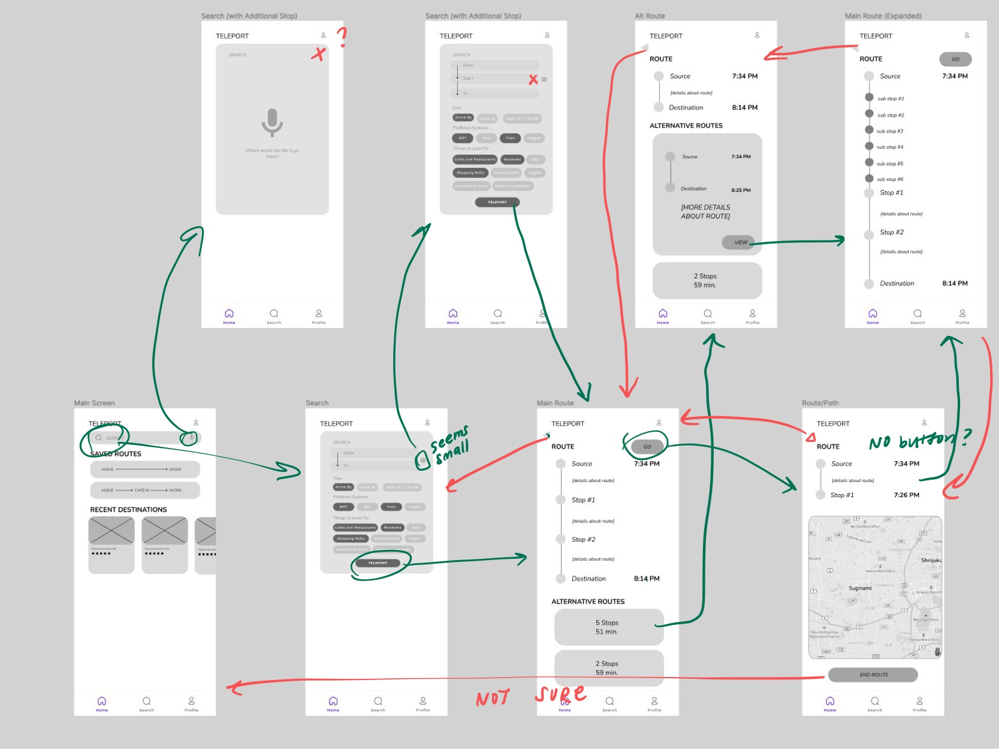
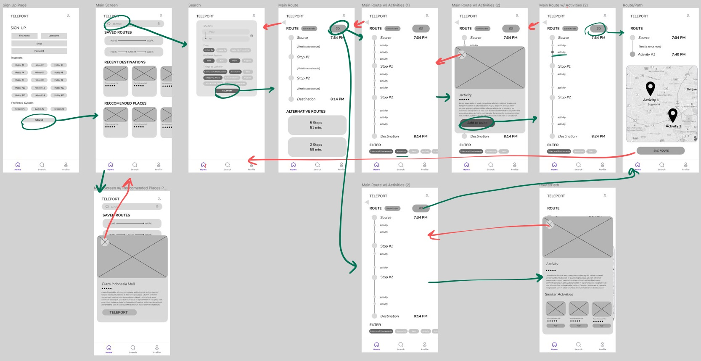
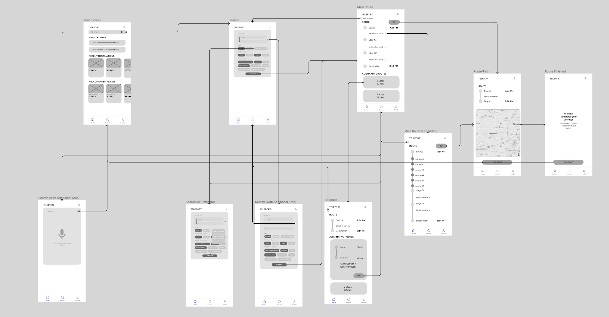

# ASSIGNMENT #05: Low Fidelity Prototype
_by Brian Roysar | DH 110: User Experience Design_

## Description of Project

### Summary of user-research, persona and the features 
From my user research, we were able to analyze the use cases for the two features I have decided to implement which are: Integrated Route-Finding and Recommended Activities. The two personas I created were people that would use each one in a different way.

Aditya wants to conveniently find the most optimal and time-efficient route to work since his current route experiences a lot of delays and changes in time which causes him to be late to work. The scenario I created to depict a use-case of this application is him using Teleport to find the best route that is tailored to his needs and preferences all in one place.
Agnes is looking for things to do on her vacation to Jakarta as this is her first time going to the city. She uses the Recommended Activities feature, where depending on her interests and hobbies, Teleport is able to curate a list of nearby activities that are most similar to what she is interested in. 

Through this prototyping exercise, we will be translating these two use cases and features into a more tangible illustration and flow, and examine the usability and feasibility of each one. 

### Purpose of Low Fidelity Prototyping
Low Fidelity Prototyping is the first step to visualizing the structure and the basic flow of the application being developed. It involves creating wireframes that illustrate the basic structure, components and information that will be presented without the stylistic details such as color, font and theme. In addition, through lo-fi prototyping, we are able to see what is feasible and what is not, while also testing the usability and tangibility of the product we are developing. It also acts as a good foundation to build future iterations and the final high fidelity prototype. 

### Wireflow #1: Integrated Route Finding

### Wireflow #2: Reccommended Activities

## Testing
After creating the wireframes and the wireflow for the two features/tasks, I conducted a test with another person that allowed me to not only get feedback for the current flow, but also notice mistakes and inefficiencies that could be improved on for future iterations. 

The link to the interview video can be found [here](https://drive.google.com/file/d/1BAG32CDZhcbzKpksoyQvgicbfSisR7QK/view?usp=share_link) (video + screen recording)

Here are the final screenshots for how the user perceived the flow of each task to be: 
### Integrated Route Finding Test

### Reccommended Activities Test

### Notes
From the test here are notes that were taken on what the user could do successfully, and what they found confusing:

* Integrated Route Finding 
  * Successful:
    * Use the search feature to progress to the routes page
    * Look up alternative routes and pick that one if they wanted
    * Add a transit spot in between source and destination
    * End route and go back to the home screen
  * Confusions:
    * Back navigation was directed to screens that I originally did not mean to go to
    * Couldn't remove a transit stop
* Recommended Activities
  * Successful:
    * View the recommended activities and see more information about it
    * Add recommended activities to the route
  * Confusions:
    * Did not realize adding activity will highlight activity on the route
    * Did not realize that changing the filters on the route page will add/remove activity points along the route

## Revisions
Since the user found the most trouble with the integrated route finding task, I decided to make revisions to include the following changes
* Exit button from microphone option
* Visual of what the time scrolling feature would be like
* Drop down between route to indicate user can learn more about intermediate stops
* A final screen when user has completed the route
* Minus button to remove transit stop

Here is the following revision:

## Reflection

All the following wireframes and wireflows can be found [here](https://www.figma.com/file/ce7OLNEwQorv5XmxA92BUD/Teleport-Lofi?node-id=0%3A1). (for better resolution)

Preparing a low fidelity prototype was very helpful for me to visualize the user’s journey when interacting with the application. It was a very quick and easy way to draft something up to see if the app has a logical and intuitive flow. In terms of the wireflow testing, I conducted it with a friend, and had her draw the transitions from wireframe to wireframe, depending on how she would interact with the app and what she expected from each interaction. This was a very good way to critically evaluate my work, since what seemed intuitive and obvious to me, might not be as obvious to another person. The process went smooth, as drawing arrows made it quick and easy for her to draw arrows and write annotations. What also went well is that I did not guide her to do certain things as I did not want to influence their decision making when interacting with the app. Something that could have been done better is to interact with more features to evaluate the app from a larger perspective than just two features. Finally, through the testing process, I was able to make revisions to the integrated route finding feature as shown above. 

If I was to make further revisions, I would take the test subject’s confusions for recommended activities and make the following changes

* Did not realize adding activity will highlight activity on the route
 * Underline the text/make the button bigger to indicate that this is clickable
 * Or, change the button shape from circle to square to differentiate with a regular stop (indicating that it is clickable)
* Did not realize that changing the filters on the route page will add/remove activity points along the route
 * Reposition the filters to a more visible part of the screen (top) to make the user more aware that they are able to add/remove activities depending on the filters they choose
