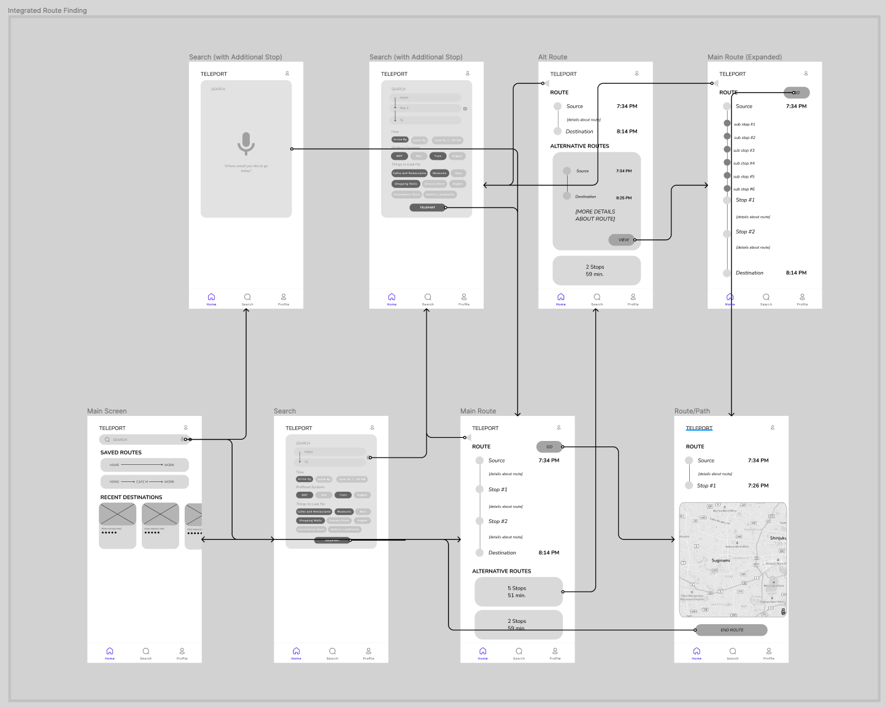
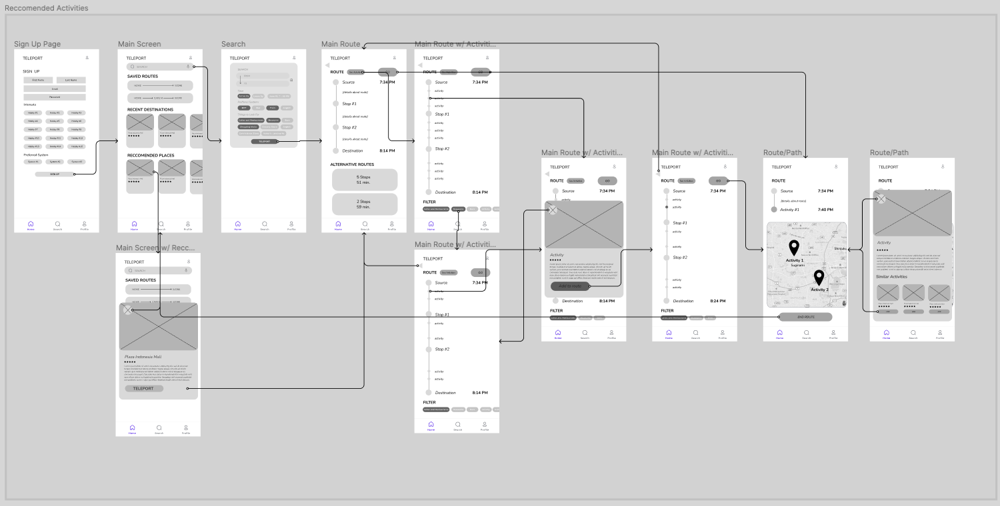

# ASSIGNMENT #05: Low Fidelity Prototype
_by Brian Roysar | DH 110: User Experience Design_

## Description of Project

### Summary of user-research, persona and the features 
From my user research, we were able to analyze the use cases for the two features I have decided to implement which are: Integrated Route-Finding and Recommended Activities. The two personas I created were people that would use each one in a different way.

Aditya wants to conveniently find the most optimal and time-efficient route to work since his current route experiences a lot of delays and changes in time which causes him to be late to work. The scenario I created to depict a use-case of this application is him using Teleport to find the best route that is tailored to his needs and preferences all in one place.
Agnes is looking for things to do on her vacation to Jakarta as this is her first time going to the city. She uses the Recommended Activities feature, where depending on her interests and hobbies, Teleport is able to curate a list of nearby activities that are most similar to what she is interested in. 

Through this prototyping exercise, we will be translating these two use cases and features into a more tangible illustration and flow, and examine the usability and feasibility of each one. 

### Purpose of Low Fidelity Prototyping
Low Fidelity Prototyping is the first step to visualizing the structure and the basic flow of the application being developed. It involves creating wireframes that illustrate the basic structure, components and information that will be presented without the stylistic details such as color, font and theme. In addition, through lo-fi prototyping, we are able to see what is feasible and what is not, while also testing the usability and tangibility of the product we are developing. It also acts as a good foundation to build future iterations and the final high fidelity prototype. 

### Wireflow #1: Integrated Route Finding

### Wireflow #2: Reccommended Activities

