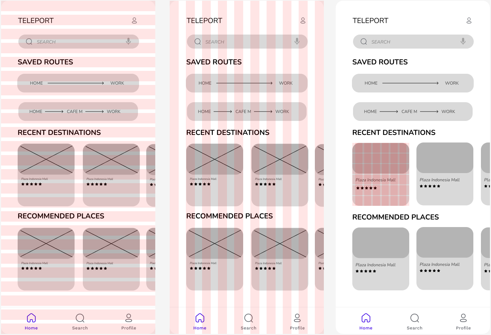
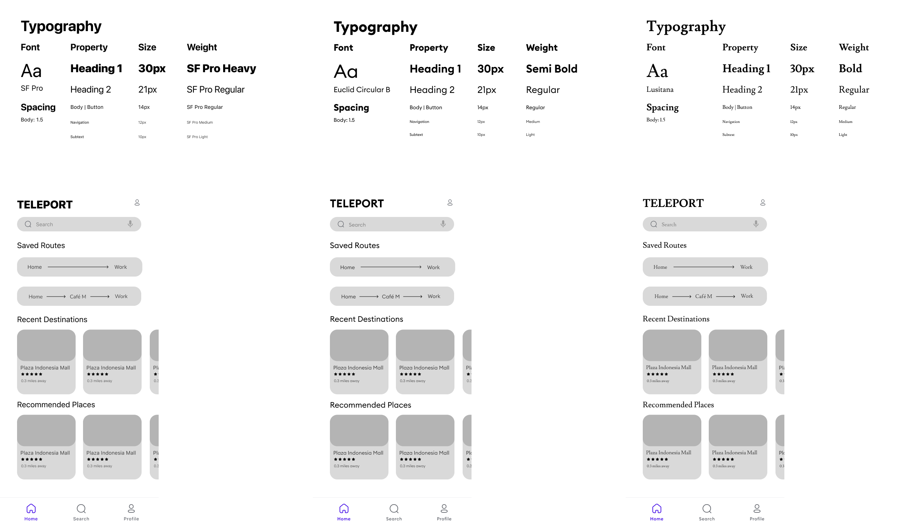
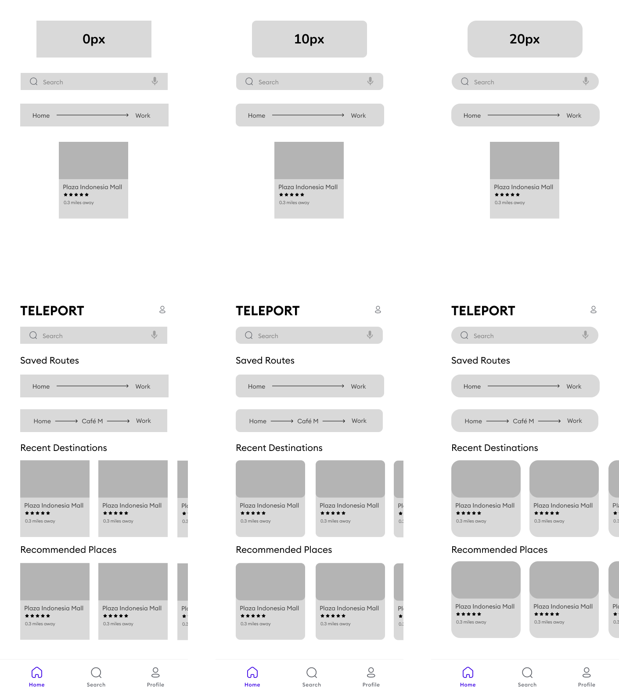
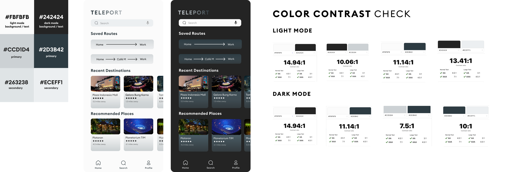
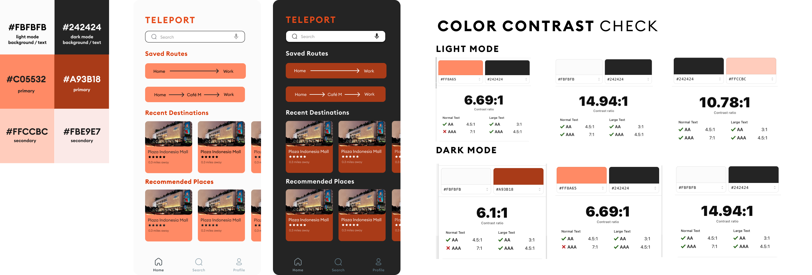

# ASSIGNMENT #05: Interface Design
_by Brian Roysar | DH 110: User Experience Design_

## Description of Project
In this assignment, we will be seeing how the Teleport app will visually look beyond the low-fidelity prototype we initially created. The purpose of interface design is to transition from the barebone low-fidelity prototype that we have to digital designs that incorporate stylistic decisions such as typography, color choice, and shape choice. Through iterating through different versions, we are able to explore multiple aesthetics that we can choose from to create our final interactive prototype. In addition, it is also important to consider that the colors we choose here are web-compatible with the right amount of contrast. 

[INSERT PROCESS HERE]

##

## Structure + Layout

## Typographic Variation

## Shape Variation

## Color Variation

