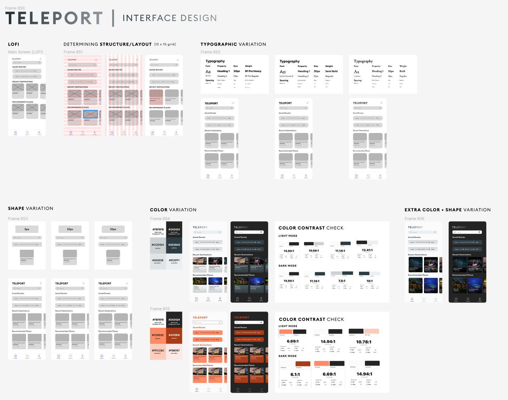
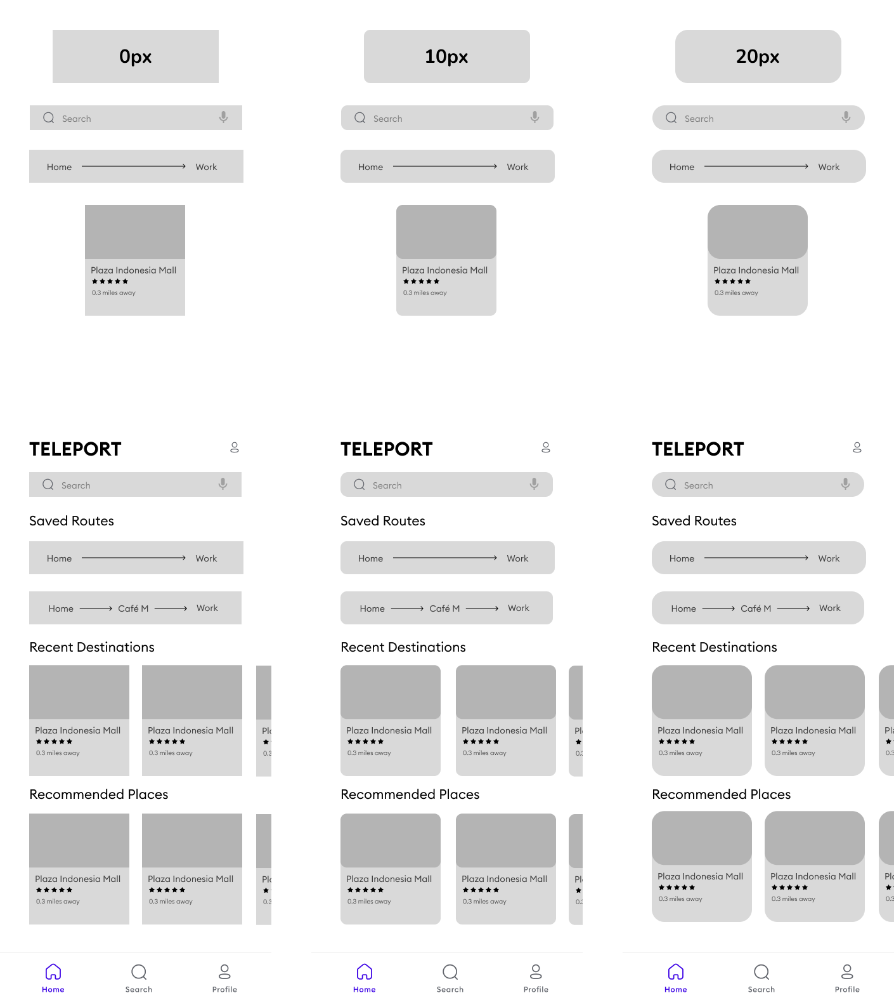
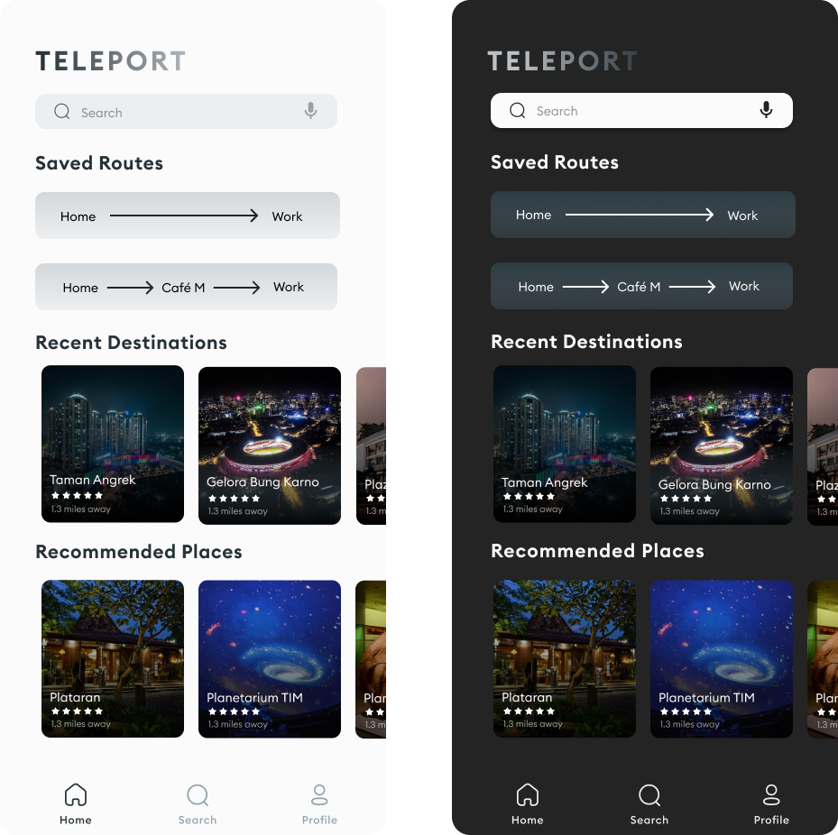

# ASSIGNMENT #05: Interface Design
_by Brian Roysar | DH 110: User Experience Design_

## Description of Project
In this assignment, we will be seeing how the Teleport app will visually look beyond the low-fidelity prototype we initially created. The purpose of interface design is to transition from the barebone low-fidelity prototype that we have to digital designs that incorporate stylistic decisions such as typography, color choice, and shape choice. Through iterating through different versions, we are able to explore multiple aesthetics that we can choose from to create our final interactive prototype. In addition, it is also important to consider that the colors we choose here are web-compatible with the right amount of contrast. 

### Design Process
I started by using the home screen that I created in the low-fidelity prototype phase which was done on Figma and made a new design file to start the interface design process. First, I focused on the structure of the page by establishing the grid layout I wanted while also focusing on Gesalt’s laws that encapsulates principles such as proximity, continuity and similarity when deciding where each element and component should be placed. In terms of the screen size, I decided to use the dimensions of the iPhone 13 Pro Max which has a resolution of 2778x1284 pixels. Then, I moved on to focusing on choosing the typography I wanted the app to use, and this involved choosing the font, font sizes for different types of text, line spacing and character spacing. Finally, we focus on color and shape variations, where I explored different roundness options for the buttons and components, as well as the color palette for the whole application. 

### Figma Links
Here is the [link](https://www.figma.com/file/uEISIsSiGdifLYI0xHQ2vW/Interface-Deisgn?node-id=0%3A1) to the Figma design file that has all the wireframes for each step of the desgin process.

Here is the [link](https://www.figma.com/proto/uEISIsSiGdifLYI0xHQ2vW/Interface-Deisgn?page-id=21%3A3667&node-id=21%3A3668&viewport=1204%2C666%2C1.35&scaling=min-zoom) to the Figma full-screen prototype of the final interface design for the home page.

##

## Structure + Layout

## Typographic Variation

## Shape Variation

## Color Variation

## Extra Variation

