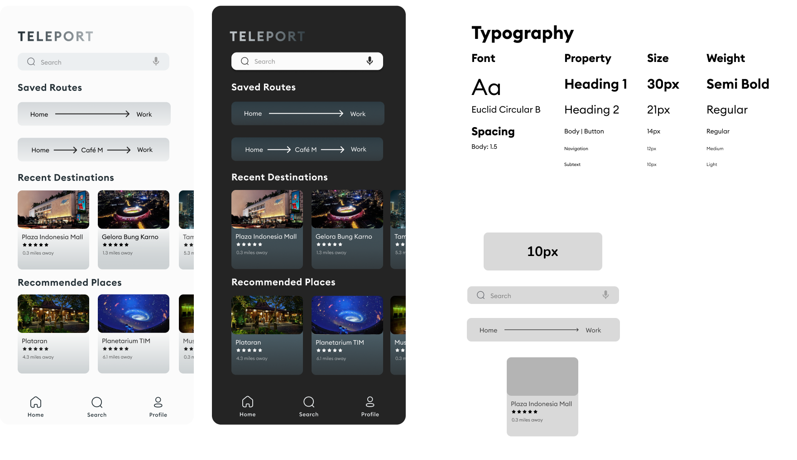

# ASSIGNMENT #05: Interface Design
_by Brian Roysar | DH 110: User Experience Design_

## Description of Project
In this assignment, we will be seeing how the Teleport app will visually look beyond the low-fidelity prototype we initially created. The purpose of interface design is to transition from the barebone low-fidelity prototype that we have to digital designs that incorporate stylistic decisions such as typography, color choice, and shape choice. Through iterating through different versions, we are able to explore multiple aesthetics that we can choose from to create our final interactive prototype. In addition, it is also important to consider that the colors we choose here are web-compatible with the right amount of contrast. 

### Design Process
I started by using the home screen that I created in the low-fidelity prototype phase which was done on Figma and made a new design file to start the interface design process. First, I focused on the structure of the page by establishing the grid layout I wanted while also focusing on Gesalt’s laws that encapsulates principles such as proximity, continuity and similarity when deciding where each element and component should be placed. In terms of the screen size, I decided to use the dimensions of the iPhone 13 Pro Max which has a resolution of 2778x1284 pixels. Then, I moved on to focusing on choosing the typography I wanted the app to use, and this involved choosing the font, font sizes for different types of text, line spacing and character spacing. Finally, we focus on color and shape variations, where I explored different roundness options for the buttons and components, as well as the color palette for the whole application. 

### Figma Links
Here is the [link](https://www.figma.com/file/uEISIsSiGdifLYI0xHQ2vW/Interface-Deisgn?node-id=0%3A1) to the Figma design file that has all the wireframes for each step of the desgin process.

Here is the [link](https://www.figma.com/proto/uEISIsSiGdifLYI0xHQ2vW/Interface-Deisgn?page-id=21%3A3667&node-id=21%3A3668&viewport=1204%2C666%2C1.35&scaling=min-zoom) to the Figma full-screen prototype of the final interface design for the home page.

##

## Structure + Layout
Here, I decided on the layout for the overall page as well as the component that is responsible for displaying recently visited and reccomended places. I decided on a 12x10 grid with a horizontal gutter of 10px and vertical gutter of 20px. For the component, I decided on a 6x6 grid with a horizontal gutter of 3px, vertical gutter of 5px and vertical margin of 8px.

## Typographic Variation

## Shape Variation

## Color Variation + Accessibility (color-contrast) Check
For the accessibility and contrast check, I used the Stark plugin on figma to test that text would be legible for both the light and dark mode, which all of them passed the required ratio threshold.

## Impression Test
Here is the [link](https://drive.google.com/file/d/1d4mBr92fHrgb6a2Bm8q6XKa9NV9-xaD6/view?usp=share_link) to the recording for the impression test I did.

These are the main takeaways I got from the test:
* Logo was big, clear and visible
* Clean and simple look
* Easy and straightforward
* Neutral feel
* A lot of space for users to breathe
* Images were boxed to provide structure
* Modern look

## Final Interface Design

### Structure and Layout

### Typogaraphy, Color

For the final interface design, here are the final specifications and details:
* 12 x 10 grid for screen
* 6 x 6 grid for component
* Euclid Circular B font, body spacing of 1.5
* 10px roundness 
* Grey/Blue color pallete

For the typography, I explored different types of fonts that could work with the application. I tried using both sans serif (SF Pro and Euclid Circular B) and serif fonts (Lusinata), and decided that sans serif fonts were more suitable as it made the app look more modern and friendly. I finally chose Euclid Circular B over SF Pro due to the fact that it had a more round feel and look, making the app feel more inviting to use. 

I experimented with different roundess to the components and was deciding between 0px, 10px, and 20px. The componenets without any roundness made the app feel very rigid and outdated, while the 20px felt too extreme. I decided on the 10px option as it provided good structure, while making each component inviting and still have structure. I also wanted to include roundness as it fit the round structure/frame of the iPhone 13 Pro Max.

For the color pallete, I explored and was deciding between a blue or orange pallete. The orange pallete made the app feel more vibrant and pop out, but I wanted to make the app feel inviting and calm to use which is why I decided on the blue color pallete. This was also suitable for the app as MRT Jakarta and the bus system utilize a blue color pallete as well. 

## Extra Variation
Upon the impression test, I wanted to make the application feel more modenrn. To do this, I made a small alteration to the component that was responsible for displaying recommended places and recently visited places. I made the image cover the whole component, while the text lies on the bottom third of the component over a dark gradient to make the text still readable. 

