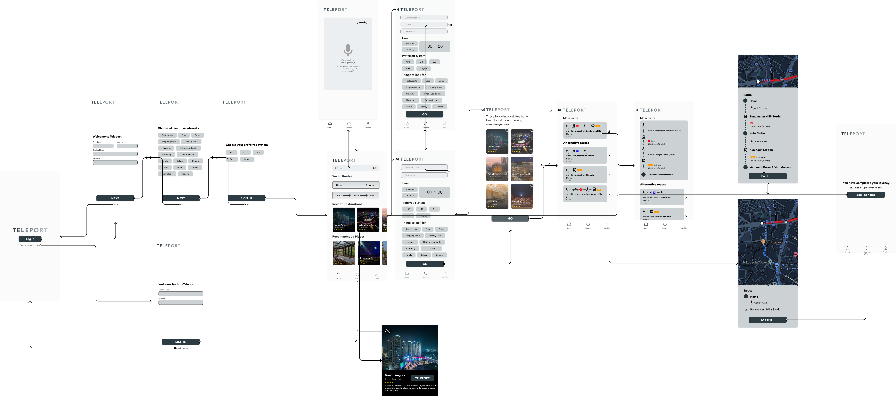

# ASSIGNMENT #07: High Fidelity Prototype
_by Brian Roysar | DH 110: High Fidelity Prototype_

## About this project 

Teleport aims to help users to find the most optimal routes using all of Jakarta's public transportation systems such as the MRT, bus and train. It also suggest users with fun and interesting things to do along the way that are specifically tailored to their interests and hobbies. In this phase of the project, we merge our Interface Design with our low fidelity prototype to create a high fidelity prototype. The purpose of this is to simulate what the working application will work, encapsulating both the flow and design of the application. It will also help us to understand the user experience when using the application since the prototype will mimic how the app will function and look like. 

To create the high fidelity prototype, I used the low fidelity wireframes as a starting point, and used Figma to apply the interface design (color, typography, layout, shapes) onto each wireframe, and adjusting and making tweaks along the way. Along the way, I benefitted from a plethora of Figma's functionalities such as creating components, multi-frame animations, overlays, and animated transitions. Finally, to create the wireflows, I utilized the Autoflow plugin on Figma.

## Tasks

### Primary Tasks
1. Integrated Route Finding: Find the most optimal route that uses Jakarta's public transportations systems and that are tailored to the users needs
2. Recommended Activities: Find fun things to do along the user's route

### Minor/Secondary Tasks/Funtions
1. Login/Signup: Create or access your account
2. Live map/status during your route: See where you are at during the commute

## Interactive Prototype
Here is a [link](https://www.figma.com/proto/27qpe9a6vsMMODqkl8MStR/Teleport-Hifi-Prototype?node-id=49%3A2538&viewport=1251%2C725%2C0.17&scaling=min-zoom&starting-point-node-id=49%3A3102) to the interactive prototype for Teleport.

Here is the Figma [file](https://www.figma.com/file/27qpe9a6vsMMODqkl8MStR/Teleport-Hifi-Prototype?node-id=22%3A2968&t=pGEyGeAs3WFw0Ahf-1) that was used for the interactive prototype.

## Wireflow with Interface Design

